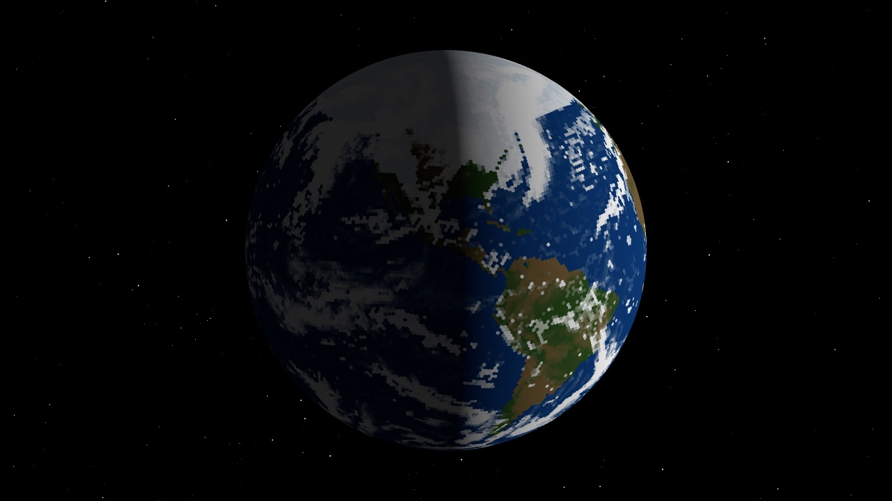

# Geodesic

A planet on a hexagonal grid, simulated in the browser.

Live at https://jlhawn.github.io/geodesic/

- **[Climate model](https://jlhawn.github.io/geodesic/climate.html)** — a hydrostatic atmosphere on a geodesic C-grid with moist physics, a two-layer ocean, sea ice, snow and real continents with terrain, integrated on the GPU through WebGPU. Design notes in [docs/c-grid-dynamical-core.md](docs/c-grid-dynamical-core.md), plans in [docs/roadmap.md](docs/roadmap.md).
- **[Geodesic grid](https://jlhawn.github.io/geodesic/grid.html)** — the original geodesic polyhedron viewer (Three.js).
- **[Synoptic charts](https://jlhawn.github.io/geodesic/charts.html)** — pressure-level charts drawn from saved model states.

To run locally, serve the repository with `python3 httpd.py` and open http://localhost:8000/. The model needs the page cross-origin isolated (`Cross-Origin-Opener-Policy: same-origin` and `Cross-Origin-Embedder-Policy: require-corp`), which that server and the `_headers` file for Cloudflare or Netlify Pages both provide. `npm test` runs the test suite.

